<div align="center">
  
</div>

<div align="center">

  <a href="https://github.com/Aditya2073">
    
  </a>

  <br/>

  
  <a href="https://github.com/Aditya2073?tab=followers">
    
  </a>
  <a href="https://github.com/Aditya2073?tab=repositories">
    
  </a>

</div>

---

## 💫 About Me

```python
class Aditya:
    def __init__(self):
        self.name     = "Aditya Ganesh Rasal"
        self.role     = "AI & Data Science Student"
        self.location = "India 🇮🇳"
        self.stack    = ["Python", "TensorFlow", "scikit-learn", "Node.js"]
        self.learning = ["Deep Learning", "MLOps"]

    def say_hi(self):
        print("Thanks for dropping by — let's build something!")


me = Aditya()
me.say_hi()
```

- 🎓 Pursuing a degree in **Artificial Intelligence & Data Science**
- 🔭 Currently working on **`<your current project>`**
- 🌱 Levelling up in **`<what you're learning right now>`**
- 👯 Open to collaborating on **ML / data-driven projects**
- 💬 Ask me about **Python, ML, or anything in the stack below**
- ⚡ Fun fact: **`<something that makes you, you>`**

---

## 🌐 Connect With Me

<div align="center">

<a href="https://linkedin.com/in/adityaganeshrasal">
  
</a>
<a href="mailto:your.email@example.com">
  
</a>
<a href="https://github.com/Aditya2073">
  
</a>

</div>

---

## 🛠️ Tech Stack

<div align="center">

**Languages**


**AI / ML & Data**


**Web & Backend**


**Databases**


**Tools & Design**


</div>

---

## 📊 GitHub Stats

<div align="center">




<br/>


<br/><br/>


</div>

---

## 🏆 GitHub Trophies

<div align="center">
  
</div>

---

## 📌 Featured Projects

| Project | What it is | Built with |
|---|---|---|
| **[nesting-instinct](https://github.com/Aditya2073/nesting-instinct)** | Tab hoarding isn't a problem — it's a LIFESTYLE. Infinite nesting, zero productivity. *DEV April Fools Challenge* |  |
| **[solstice-machine](https://github.com/Aditya2073/solstice-machine)** | A single-file browser puzzle game where you program a Turing machine on a 24-hour ring. *DEV Solstice Game Jam — for Alan Turing* |  |
| **[hermes-pr-investigator](https://github.com/Aditya2073/hermes-pr-investigator)** | Autonomous PR investigator skill for Hermes Agent. *DEV Challenge 2026* |  |
| **[AI-Expense-Tracker](https://github.com/Aditya2073/AI-Expense-Tracker)** | AI-powered expense tracker with a clean shadcn/ui-inspired design |   |
| **[ai-banking-chatbot](https://github.com/Aditya2073/ai-banking-chatbot)** | AI-based banking chatbot system powered by DeepSeek AI |   |

---

## ✍️ Random Dev Quote

<div align="center">
  
</div>

---

## 🐍 Contribution Snake

<div align="center">
  <picture>
    <source media="(prefers-color-scheme: dark)" srcset="./profile/snake-dark.svg" />
    <source media="(prefers-color-scheme: light)" srcset="./profile/snake.svg" />
    
  </picture>
</div>

<div align="center">

⭐️ **From [Aditya2073](https://github.com/Aditya2073)** — thanks for visiting!


</div>
